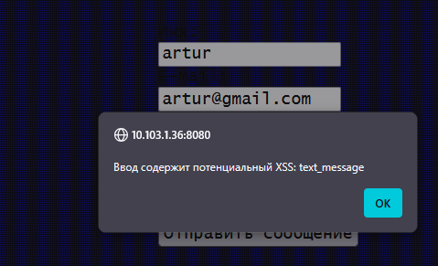

# Лабораторная работа №3. Гостевая книга и защита от XSS

## Предварительные условия
1. **База данных `guest`** — выполнено. Добавлена миграция `php-app-secure/migrations/006_create_guest.sql:1`, создающая таблицу `guest(id, user, text_message, e_mail, data_time_message)`.
2. **Мини-приложение гостевой книги** — выполнено. В маршрутизаторе объявлены эндпоинты `/guestbook` (GET/POST) и `/guestbook/unsafe` (GET) `php-app-secure/public/index.php:57`. За логику отвечает `php-app-secure/app/Controllers/GuestController.php:15`, а шаблоны с формой/списком находятся в `php-app-secure/app/Views/guest/index.php:1` и `php-app-secure/app/Views/guest/unsafe.php:1`.

## Требования лабораторной работы
1. **Демонстрация XSS-атаки** — выполнено. Страница `/guestbook/unsafe` выводит записи без экранирования `php-app-secure/app/Views/guest/unsafe.php:11`, поэтому достаточно добавить сообщение с текстом `` через форму (или напрямую в БД), чтобы при открытии небезопасной версии увидели всплывающее окно/подмену контента.
2. **Скрипты защиты от XSS** — выполнено. 
   - Серверная проверка: метод `containsXss()` и валидация в `GuestController::store()` блокируют подозрительные конструкции (``, затем откройте `/guestbook/unsafe` — страница будет изменена, что подтверждает уязвимость в небезопасном режиме.
5. Повторите попытку на защищённой странице (`/guestbook`) — отправка будет заблокирована клиентской проверкой или сервер вернёт ошибку, а сохранённые данные выводятся экранированными.

## Примечания
- Добавлена ссылка на гостевую книгу в навигации макета `php-app-secure/app/Views/layout/header.php:29`.
- Формы гостевой книги намеренно оставлены без CSS, чтобы сосредоточиться на функциональности и защите.